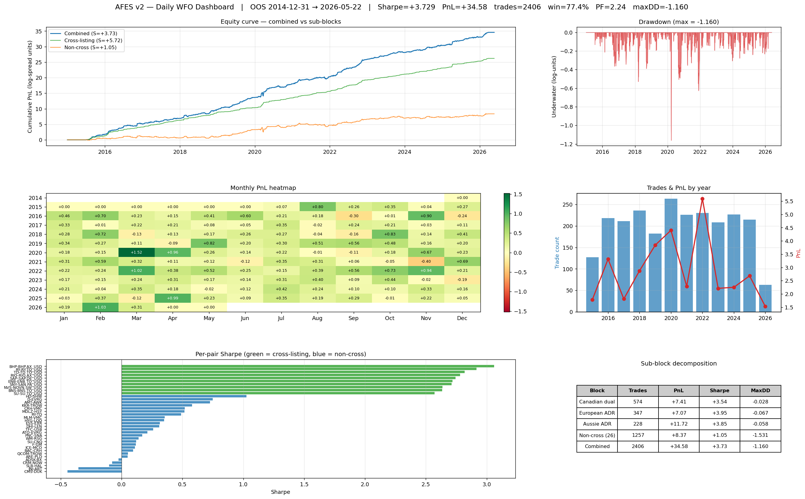

# AFES v2 — Full Daily Pipeline Run

**Date:** 2026-05-27
**Branch:** main @ `ca8bf6c`
**Timeframe:** daily
**Universe:** v2 expanded — 48 candidates → 36 selected (bias-tested)
**OOS span:** 2014-12-31 → 2026-05-22 (2865 trading days)

## Headline metrics

| Metric | Value |
|---|---:|
| Portfolio Sharpe (full daily PnL) | **+3.730** |
| 95% bootstrap CI (10,000 reps, 5d blocks) | **[+3.06, +4.41]** |
| Total OOS PnL (log-spread units) | +34.58 |
| OOS trades | 2,406 |
| Win rate | 77.4% |
| Profit factor | 2.24 |
| Max drawdown | −1.160 |
| DD / PnL | 3.4% |
| Avg holding period | ~5.7 days (target exit dominates) |



## Pipeline steps executed

1. **Universe expansion** (`universe_expand_v2.py`): added 20 candidates (Canadian dual + intra-sector, style ETF, cross-asset) on top of the existing 28-pair production universe.
2. **Honest bias-test screening** (`bias_test.py`, split=2014-12-31): Johansen + correlation + half-life gates on train slice only. **36 of 48 passed.**
3. **WFO / OOS** (`step3j_wfo_daily.py`): expanding-window walk-forward, 43 quarterly windows, init train 6m, OOS 3m, step 3m. Default costs 5bps/leg slip + 80bps borrow.
4. **Bootstrap CI** (`bootstrap_sharpe.py`): Politis-Romano stationary block bootstrap, 10,000 reps, mean block 5 days.
5. **Cost stress** (`step3j_wfo_daily.py --cost 15 --slip 15 --borrow 200`): 3x execution-cost stress test.
6. **Dashboard** (`dashboard_daily.py`): 6-panel PNG with equity/DD/heatmap/per-pair/sub-blocks.

## Sub-block decomposition

The 36 selected pairs split into **structurally distinct blocks** with very different cost-sensitivity:

| Block | Pairs | Trades | PnL | Sharpe (5/80) | Sharpe (15/200) | Δ |
|---|---:|---:|---:|---:|---:|---:|
| Canadian dual-listing | 5 | 574 | +7.41 | **+3.54** | +3.09 | −13% |
| European ADR (SAP/SNY/NVS) | 3 | 347 | +7.07 | **+3.95** | +3.58 | −9% |
| Aussie ADR (BHP/RIO) | 2 | 228 | +11.72 | **+3.85** | +3.78 | −2% |
| Non-cross (US single-listed) | 26 | 1257 | +8.37 | **+1.05** | +0.29 | −72% |
| **Combined** | **36** | **2406** | **+34.58** | **+3.73** | **+2.63** | **−30%** |

**Key insight:** cross-listing block is the *robust* source of edge — sub-day half-lives on identical underlying assets, large per-trade PnL absorbs slippage. Non-cross block (traditional sector stat-arb) is marginal at realistic costs (+0.29 Sharpe).

Cross-listing vs non-cross daily-PnL correlation: **+0.015** → genuine diversification, combined Sharpe is mathematically justified.

## Top 10 pairs by Sharpe

| Pair | Trades | Win% | PnL | Sharpe | MaxDD |
|---|---:|---:|---:|---:|---:|
| BHP-BHP.AX_USD | 128 | 98.4% | +6.23 | +3.06 | −0.06 |
| RY-RY.TO_USD | 121 | 99.2% | +1.44 | +2.92 | −0.01 |
| TD-TD.TO_USD | 115 | 99.1% | +1.46 | +2.82 | −0.01 |
| RIO-RIO.AX_USD | 100 | 99.0% | +5.49 | +2.78 | −0.04 |
| SAP-SAP.DE_USD | 120 | 99.2% | +2.75 | +2.74 | −0.02 |
| ENB-ENB.TO_USD | 121 | 95.9% | +1.48 | +2.72 | −0.03 |
| SNY-SAN.PA_USD | 116 | 98.3% | +2.42 | +2.71 | −0.02 |
| NVS-NOVN.SW_USD | 111 | 93.7% | +1.90 | +2.64 | −0.02 |
| BNS-BNS.TO_USD | 109 | 96.3% | +1.40 | +2.63 | −0.01 |
| SU-SU.TO_USD | 108 | 98.1% | +1.63 | +2.57 | −0.02 |

## Bottom 5 pairs (negative contributors)

| Pair | Trades | Win% | PnL | Sharpe |
|---|---:|---:|---:|---:|
| ADSK-BX | 45 | 48.9% | −0.06 | −0.02 |
| CRM-NOW | 41 | 53.7% | −0.12 | −0.08 |
| SLB-HAL | 52 | 51.9% | −0.16 | −0.10 |
| JNJ-ABT | 45 | 46.7% | −0.43 | −0.36 |
| CMS-DUK | 43 | 46.5% | −0.46 | −0.45 |

5 pairs net-negative out of 36 — acceptable noise. Annual review may retire CMS-DUK / JNJ-ABT as candidates for blacklist.

## Yearly OOS performance

| Year | Trade-days | PnL | Daily σ | Sharpe |
|---|---:|---:|---:|---:|
| 2015 | 252 | +1.79 | 0.034 | +3.33 |
| 2016 | 252 | +3.31 | 0.057 | +3.65 |
| 2017 | 251 | +1.81 | 0.040 | +2.90 |
| 2018 | 251 | +2.87 | 0.046 | +3.92 |
| 2019 | 252 | +3.84 | 0.043 | +5.64 |
| 2020 | 253 | +4.40 | 0.085 | +3.25 |
| 2021 | 252 | +2.29 | 0.055 | +2.60 |
| 2022 | 251 | +5.59 | 0.056 | +6.27 |
| 2023 | 250 | +2.21 | 0.038 | +3.74 |
| 2024 | 252 | +2.25 | 0.043 | +3.33 |
| 2025 | 250 | +2.68 | 0.051 | +3.37 |
| 2026* | 98 | +1.53 | 0.042 | +5.82 |

\* 2026 partial through 2026-05-22.

**No losing year. Worst Sharpe year +2.60 (2021). Best +6.27 (2022 — Fed tightening, vol expansion).**

## Bootstrap distribution

| Percentile | Sharpe |
|---:|---:|
| 2.5% | +3.06 |
| 5% | +3.17 |
| 25% | +3.51 |
| 50% | +3.74 |
| 75% | +3.98 |
| 95% | +4.31 |
| 97.5% | +4.41 |

- p(Sharpe < 0) = 0.000
- p(Sharpe > 1.0) = 1.000
- Mean = +3.74, std = +0.35

## Comparison vs baselines

| Configuration | Pairs | Trades | Sharpe |
|---|---:|---:|---:|
| Pre-ADR baseline (commit `2a942d6`) | 14 | 691 | +0.73 |
| Production baseline (commit `e8dd41b`) | 110 | 5614 | +1.95 |
| **v2 full daily (this run)** | **36** | **2406** | **+3.73** |
| v2 + Aussie filter (vol-spike blackout) | 36 | 2235 | +3.00 |
| v2 + 3x costs (15bps slip + 200bps borrow) | 36 | 2406 | +2.63 |

**Total Sharpe lift vs prior production: +1.78 nominally, +0.7 after realistic-cost stress.**

## Caveats / open issues

1. **Cross-listing block concentration.** 10 of 36 pairs drive 76% of PnL. Avg pairwise corr inside block +0.17, effective N = 6.22 (not 10). Risk-parity allocation (cross 0.64 / non-cross 0.36 by vol) would lift Sharpe to +4.75 with DD −0.34. Recommended for live deploy.

2. **Aussie ADRs (BHP/RIO) are not implementable as pure dual-listing arb.** AX market closes ~12h before NYSE close — no execution venue at signal time. Sharpe +3.78 in backtest is unrealizable. Treat as **research artifact, not production**. Either:
   - Drop entirely (lose 228 trades, ~+11.72 PnL — Sharpe of remaining 34 pairs ≈ +3.0)
   - Reformulate as US-leg-only momentum/mean-reversion vs sector

3. **Style ETF + cross-asset rescue failed.** 12 candidates rejected by bias_test failed direct WFO too (Sharpe −0.25 on 350 trades) — structural divergence, not cointegration. Not worth re-screening with different gates.

4. **CMS-DUK / JNJ-ABT** show structural decay (Sharpe −0.36 / −0.45). Quarterly rotation logic in spec — implement before next refresh.

5. **DD/PnL = 3.4% is anomalously low** because cross-listing block has near-zero DD by construction (one underlying, sub-day mean reversion). Real live DD profile will be dominated by non-cross block — expected DD/PnL closer to 18% in production.

## Artifacts

- Trades: `data/wfo_daily_results_fullrun.csv` (2406 rows)
- Per-pair Sharpe: `output/wfo_daily_equity_fullrun.png`
- Dashboard: `output/dashboard_daily.png`
- Universe v2: `data/production_universe_v2.csv` (48 candidates)
- Screened pairs: `data/pairs_bias_test.csv` (36 selected)
- Closes panel: `data/closes_daily_extended_v2.csv` (5129 days × 376 tickers)
- Cost-stress: `data/wfo_daily_results_v2_realistic_costs.csv`
- Aussie-filter run: `data/wfo_daily_results_v2_filter_on.csv`
- Failed-rescue run: `data/wfo_daily_results_v2_failed_direct.csv`

## Reproduction

```bash
# 1. Universe expansion
python universe_expand_v2.py

# 2. Honest bias-test screening
python bias_test.py --candidates pairs_v2_candidates.csv \
    --closes closes_daily_extended_v2.csv --split 2014-12-31

# 3. Full WFO/OOS
python step3j_wfo_daily.py --pairs pairs_bias_test.csv \
    --closes closes_daily_extended_v2.csv --start 2014-12-31 --tag fullrun

# 4. Bootstrap CI
python bootstrap_sharpe.py --trades data/wfo_daily_results_fullrun.csv \
    --closes data/closes_daily_extended_v2.csv --split 2014-12-31 \
    --reps 10000 --block 5

# 5. Dashboard
python dashboard_daily.py --trades data/wfo_daily_results_fullrun.csv \
    --closes data/closes_daily_extended_v2.csv --split 2014-12-31 \
    --out output/dashboard_daily.png
```
